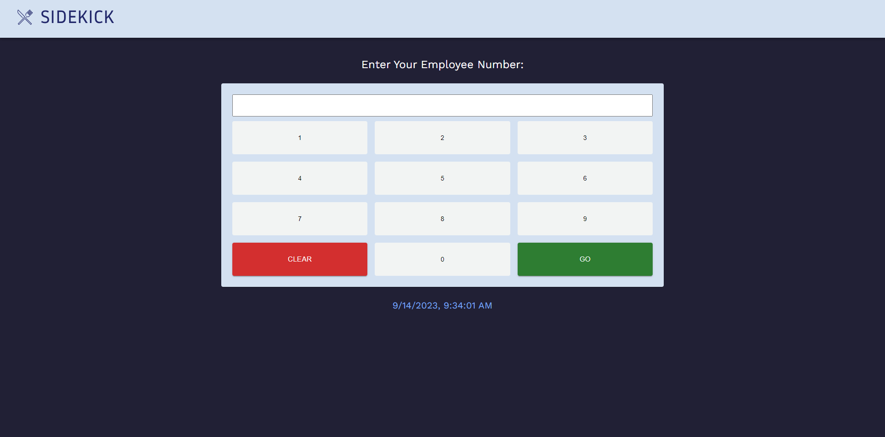
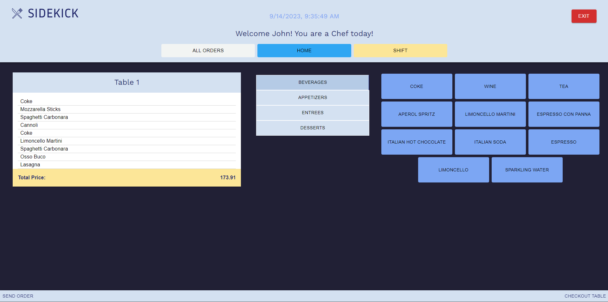

# Sidekick, Final Project-Group-2      

### Contributors: Alina Badillo, Christopher Banta, Antonio Giuliani, Savannah Shifflet, Andrew Wilson

---
### Description 
---
A front end restaurant website with an attached pos system application accessible through the admin / manager login to provide an all-in-one solution for small-business owners. The POS system utilizes React, Node.js, Express, MongoDB, and GraphQL to bring the application to life. 

[Project Presentation](https://docs.google.com/presentation/d/1dRKrV4Ui5xt-BH2bUPDGDbUNO8gBaaFDLHuy7IzZKmc/edit?usp=sharing)

### Table of Contents
---
- [Technologies](#technologies)
- [Installation](#installation)
- [Usage](#usage)
- [Credits](#credits)
- [License](#license)

### Technologies 
---
Technologies used for this application include: 
- Languages: CSS, HTML, JavaScript
- CSS Framework: [Material UI](https://mui.com/material-ui/)
- Front-End Framework: [React](https://react.dev/)
- Database: [MongoDB](https://www.mongodb.com/)
- Query language: [GraphQL](https://graphql.org/)
- Deployed using [Heroku](https://dashboard.heroku.com/apps) 
- (Node.js)[https://nodejs.org/en]
- Node packages:
  - [dotenv](https://www.npmjs.com/package/dotenv)
  - [Express](https://www.npmjs.com/package/express)
  - [JSON Web Token](https://jwt.io/)
  - [Mongoose](https://mongoosejs.com/)
  - [React Router](https://reactrouter.com/en/main)
 
  Database schema:
  

### Installation 
---
If you'd like to download the code, clone it to your local machine using: 

    git clone git@github.com:AlinaB108/pos-system-5000.git

Additionally, this code uses node.js packages which can be installed by running the following command:
    
    npm install 

### Usage 
---
You can log into the application at the deployed link [here](https://sidekick-pos-a138f104c04c.herokuapp.com/pos) using a fake employee's id: 1000. 

---

### Credits 
---
  - [Alina Badillo](https://github.com/AlinaB108)
  - [Christopher Banta](https://github.com/BantaChristopher)
  - [Antonio Giuliani](https://github.com/T0ny-Macaroni)
  - [Savannah Shifflet](https://github.com/Savannah-Shifflet)
  - [Andrew Wilson](https://github.com/pingdrew)

### License 
---
This application is covered under the MIT License. 

